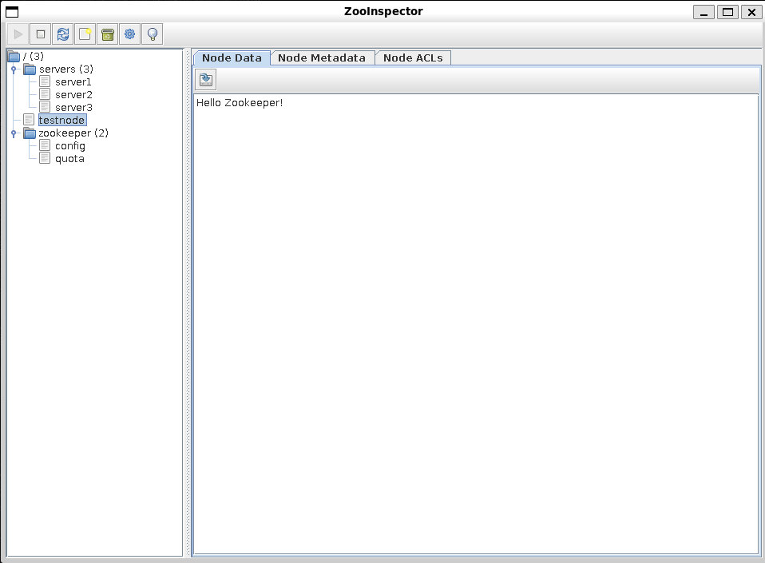

# Zookeeper Dive

Simple project for Zookeeper/Kazoo design.

Apache Zookeeper is a distributed coordination service used to solve complex problems. Akin to a synchronized filesystem, data is stored in a hierarchical namespace and in this filesystem data is stored in nodes called `ZNodes` where data is stored. It's also open-source ([zookeeper](https://github.com/apache/zookeeper)). 

[kazoo](https://github.com/python-zk/kazoo/tree/master) is a high-level library used to interact with Zookeeper for Python clients. ([Read the docs](https://kazoo.readthedocs.io/en/latest/))

Requirements
- **Project Requirements**: Run `make install` to install `kazoo`
- **Docker Installation**: Docker needs to be installed to run the Zookeeper container

### Usage
Initialize the Docker daemon and Zookeeper container..
```
// Start the Docker daemon
$ sudo dockerd

// OR 
$ sudo systemctl start docker

// Then start the Zookeeper Container
$ docker compose -f docker-compose.yml up -d
```

Run `python3 main.py` to execute the process of creating test ZNodes that correspond to different servers, with each server having it's own IP address. Shell into the container and execute commands..
```
$ docker exec -it zookeeper bash
...

[appuser@123 ~]$ zookeeper-shell localhost:2181
Connecting to localhost:2181
Welcome to ZooKeeper!
JLine support is disabled

WATCHER::

WatchedEvent state:SyncConnected type:None path:null
ls /servers
```

**Note**: Use ZooInspector to view the Zookeeper data via a GUI using `/bin/zooinspector`


### Docker Install for Debian

```
// Update package lists
$ sudo apt update
```

Install required Docker packages

```
$ sudo apt install apt-transport-https ca-certificates curl gnupg2 software-properties-common
```

Add Docker's official GPG key
```
$ curl -fsSL https://download.docker.com/linux/debian/gpg | sudo gpg --dearmor -o /usr/share/keyrings/docker-archive-keyring.gpg
```

Add the Docker repository
```
$ echo "deb [arch=$(dpkg --print-architecture) signed-by=/usr/share/keyrings/docker-archive-keyring.gpg] https://download.docker.com/linux/debian $(lsb_release -cs) stable" | sudo tee /etc/apt/sources.list.d/docker.list > /dev/null
```

Install the Docker Engine, CLI and containerd
```
$ sudo apt install docker-ce docker-ce-cli containerd.io docker-compose-plugin
```